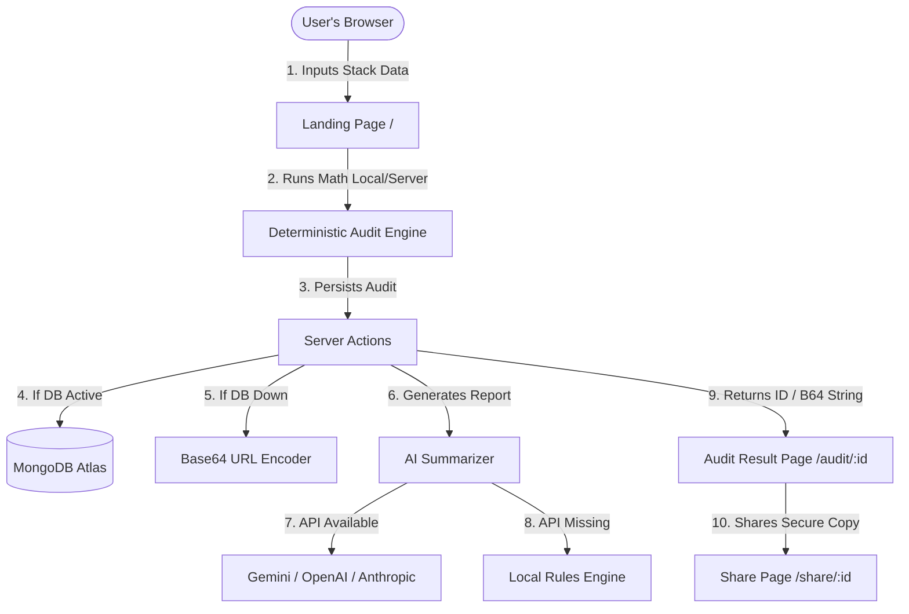

# Credex.ai - Technical Architecture Blueprint

This document details the software architecture, data modeling, cost calculation formulas, database persistence, and fallback systems utilized by Credex.ai.

---

## 🏗️ Technical Architecture Overview

Credex is built as a highly responsive Next.js 15 application leveraging React 19. It uses a server-side rendering (SSR) strategy for pages to guarantee search engine crawler discoverability, while delegating interactive widgets (spend input grids, charts) to client-side react components.

---

## 🗃️ Data Model & Persistence Schema

Credex persists audit calculations and customer leads via two primary Mongoose schemas.

### 1. Audit Schema (`src/models/Audit.ts`)
Stores the complete state of a user's audited tools and generated recommendations:
- **`tools`**: Array of audited rows containing `name`, `plan`, `seats`, and `monthlySpend`.
- **`teamSize`**: Total employee count used for baseline seats validation.
- **`primaryUseCase`**: Startup focus category (`coding`, `research`, `writing`, `mixed`).
- **`currentMonthlySpend` / `optimizedMonthlySpend`**: Mathematical aggregates.
- **`monthlySavings` / `annualSavings`**: Absolute calculated differentials.
- **`recommendations`**: Embedded schema listing optimized plan adjustments.

### 2. Lead Schema (`src/models/Lead.ts`)
Captures user emails and details for outbound enterprise follow-ups:
- **`email`**: User email address (with index constraints).
- **`companyName`**: Optional startup name.
- **`auditId`**: Foreign reference matching the saved `Audit` record.

---

## 🧮 Deterministic Cost Optimization Rules

Unlike LLMs which may output inconsistent pricing recommendations, Credex applies rigid financial heuristic calculations in `src/utils/auditEngine.ts`:

1. **IDE Overlap Redundancy**: If a single workspace uses both `Cursor Pro/Business` and `Windsurf Pro`, it triggers a consolidation flag suggesting standardizing on Cursor (the industry benchmark) to save $15-$20/mo per seat.
2. **Autocomplete Plugin Redundancy**: If `Cursor` (which includes native tab-autocomplete) is used alongside `GitHub Copilot`, the engine flags Copilot as redundant, saving $10-$19/mo per seat.
3. **ChatGPT & Claude Double Subscriptions**: If individual `Claude Pro` and `ChatGPT Plus` seats are both active in a small team, the engine recommends consolidating to one chat provider, recouping $20/mo per seat.
4. **Single-Seat Team Plan Inflation**: Startups frequently purchase "Team" subscriptions (which require a 2-seat minimum or charge premium rates) for only 1 user. The engine flags this, suggesting a downgrade to a single "Pro" user to save 20-30% of the cost.
5. **Small Team Enterprise Downsizing**: Identifies Claude/ChatGPT "Enterprise" licenses active in teams with fewer than 10 total users, advising a shift down to "Team" plans.

---

## 🔄 Base64 Database-less Compression Engine

To ensure **100% offline uptime** and a seamless local development experience without setting up a MongoDB Atlas cluster, Credex uses a custom Base64 state serializer:

- When an audit is completed, if the MongoDB driver fails to establish a pool connection, the server action compresses the entire JSON payload using Node's native `zlib` deflate compression.
- The compressed binary stream is encoded into a URL-safe Base64 token prefixed with `b64_`.
- The user is redirected to `/audit/b64_eJyrVkr...`
- The server page `/audit/[id]` detects the `b64_` prefix, extracts the payload, decompresses it via `zlib` inflate, and reconstructs the dashboard on-the-fly.
- This results in zero broken pages and guarantees sharing links work everywhere under any network constraint.
