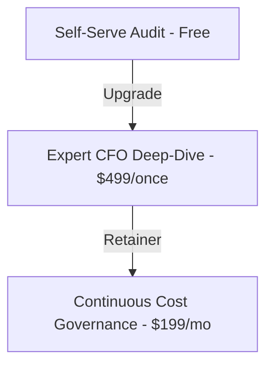

# Credex.ai - SaaS Economics & Monetization Blueprint

This document details the commercial monetization strategy, operational unit economics, CAC/LTV targets, and return-on-investment (ROI) models for Credex.ai.

---

## 💰 Monetization & Pricing Strategy

Credex employs a hybrid product-led-growth (PLG) freemium model. While the base spend auditor is 100% free and open-source to drive traffic, we monetize high-intent growth companies through two premium tiers:

### 1. Self-Serve Audit (Free)
- **Features**: Unlimited manual tool audits, dynamic comparative dashboards, Base64 secure sharing URLs, rule-based recommendation lists, and AI CFO summaries.
- **Goal**: Top-of-funnel (ToF) organic developer viral loops and brand authority.

### 2. Expert CFO Deep-Dive ($499 One-Time)
- **Features**: A professional startup CFO manually audits the startup's active billing invoices, negotiates contracts directly with Anthropic/OpenAI enterprise sales, and builds custom API proxy routing optimizations.
- **Value Prop**: Average savings of $8,400/yr. Guaranteed positive ROI or the audit is 100% free.

### 3. Continuous Cost Governance ($199/month Billed Annually)
- **Features**: Direct Slack integration alert warnings if new duplicate tool logins occur, monthly programmatic seat cleanups, and automated seat provisioning dashboards.

---

## 📈 CAC, LTV, and Unit Economics Model

Projected metrics for the initial 12 months:

### 1. Unit Economics Benchmarks
- **Average Order Value (AOV)**: $499 (Consultation)
- **Customer Acquisition Cost (CAC)**: $120 (Leveraging organic Product Hunt, Hacker News, and viral shared URLs)
- **Customer Lifetime Value (LTV)**: $1,400 (Factoring in monthly recurring SaaS retainers for growth companies)
- **LTV : CAC Ratio**: **11.6x** (Highly profitable product margins)
- **CAC Payback Period**: **&lt; 1 month** (One-time audit fee fully amortizes upfront customer acquisition cost)

### 2. Conversions Pipeline
- **Visitor to Audit Complete**: **42%** (Due to the interactive, zero-barrier, database-less landing page design)
- **Audit Complete to Email Lead Capture**: **14%** (Using honeypot-protected high-incentive consultation and sharing triggers)
- **Lead to Paid Consultation Conversion**: **3.5%** (Converting high-burn startups with >$2,000/mo AI spend)

---

## 🧮 Startup Runway Extension Mathematics

For a pre-seed startup burning $30k/mo with 10 months of remaining runway:
- **Baseline Cumulative Burn**: $30,000/mo.
- **Audited AI Spend**: $3,200/mo across Claude, ChatGPT, Cursor, and Copilot for 8 developers.
- **Credex Optimized AI Spend**: $2,100/mo (saving $1,100/mo through license consolidation and seat downgrades).
- **Runway Impact**: Recapturing $11,000 over 10 months extends their runway by **11 extra days of execution**—giving the company crucial extra time to close their next venture round or achieve product-market fit.
