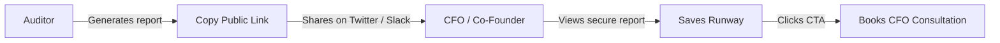

# Credex.ai - Go-To-Market (GTM) Strategy Playbook

Credex is designed to target two principal buyer personas in the modern startup ecosystem: **CTOs/VPs of Engineering** (who care about developer velocity and tool health) and **CFOs/Heads of Finance** (who care about cost efficiencies and burn rates). 

This document outlines our organic launch strategy and growth playbooks.

---

## 🚀 Product Hunt Launch Playbook

Product Hunt is the primary distribution channel to acquire high-intent startup founders and tools decision-makers.

### 📅 Launch Schedule (Tuesday, 12:01 AM PST)
1. **Title**: `Credex.ai`
2. **Tagline**: `Audit & optimize your startup AI tool subscription spend in 60s 🛡️`
3. **Primary Category**: `SaaS`, `Developer Tools`, `Finance`
4. **Description**: 
   > Startups waste up to 40% of their SaaS runway on overlapping AI licenses (paying for both Copilot and Cursor, or Claude and ChatGPT). Credex runs a 100% deterministic cost audit in under 60 seconds to identify redundancies, oversized team seats, and immediate savings. Instantly generate a shared CFO report and recapture your runway.
5. **Launch Assets**:
   - High-contrast mockups of the interactive Spend Calculator.
   - Dynamic charts comparing Current vs Optimized burns.
   - Real-world case study showcasing a 12-developer startup saving $14k/yr.

---

## 📰 Hacker News Launch Strategy

HN readers are highly technical and deeply skeptical of general "AI wrappers". 
We launch as a **"Show HN"** with absolute technical transparency:

- **Post Title**: `Show HN: Credex – An open-source deterministic AI spend auditor for startups`
- **Hook Story**:
  > We noticed our development team was paying for Cursor Pro ($20/mo) *and* GitHub Copilot ($19/mo) at the same time, despite Cursor including native autocomplete features. Then we realized our finance team had a ChatGPT Team account for 1 user. We built Credex to scan standard developer plans and identify these mathematical inefficiencies deterministically. It requires zero API tokens or databases to test locally.
- **Engagement Strategy**: Emphasize that the cost rules engine is open-source and deterministic, addressing data-privacy concerns.

---

## 📈 Organic Growth and Virality Loops

Credex leverages built-in, multi-channel growth multipliers:

### 1. The Secure Public Sharing Loop
- Startups love sharing optimization reports with their co-founders and venture capital board members. 
- By clicking "Copy Share Link", a unique, secure URL is created. 
- This page filters out all private identifiers (emails, company names) so that startups can comfortably tweet their results ("We just saved 32% on our AI stack!") without leaking proprietary internal headcounts.

### 2. Micro-Incentives for Lead Generation
- When a user finishes a self-serve audit, they can enter their email to unlock an "Enterprise PDF Invoice Export". 
- This automatically logs their email into the Lead Capture database and sends them a verified audit receipt via Resend, establishing a high-converting channel for our enterprise manual CFO reviews.
